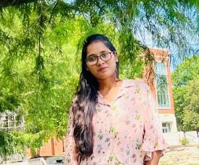

### Minitha Sai Penumachha

I am Minitha Sai Penumachha from Hyderabad, India. I have completed my Bachelors at Veltech Rangarajan Dr. Sagunthala R&D Institute of Science and Technology in 2022. I want to gain more knowledge in this field and to  improve my technical skills. My goal is to become a full stack developer. 

Link to my image : 

---

### Cities to visit

There are few cities  which I am interested to visit. I will suggest others also to visit those places .  the columns are name of the city, location to visit, time to spend are mentioned in the table below:

|City | Location | Time |
| --- | --- | ---|
| Banglore | Lal Bagh Botanical Garden | 2 day |
| New Delhi | Red Fort | 1 day|
| Puducherry | Aurobindo Ashram | 3 day |
| Agra | Taj Mahal | 4 day |

---

###  Pithy Quotes

> Be loud about the things that are important to you. *Karen Walrond*
> Good decisions come from experience. Experience comes from making bad decisions. *Mark Twain*

